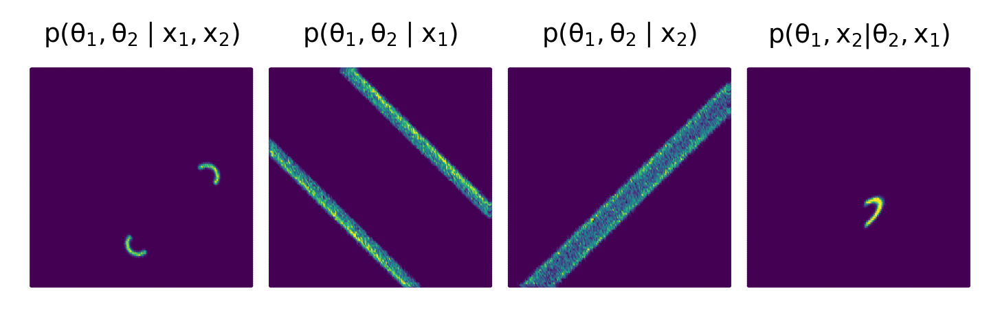

### Figure 3

This figure requires running the following experiments (actually just a subset of them)
```bash
scoresbi +experiment=bm_all_cond 
```




### Figure 4
This figure requires running the following experiments
```bash
scoresbi +experiment=bm 
scoresbi +experiment=bm_base
```
Which will produce all results for panal a).

To produce panel b) run the following experiments
```bash
scoresbi +experiment=bm_all_cond 
```


### Appendix

To produce the appendix run the following experiments
```bash
scoresbi +experiment=bm 
scoresbi +experiment=bm_base
scoresbi +experiment=bm_score_base
```


