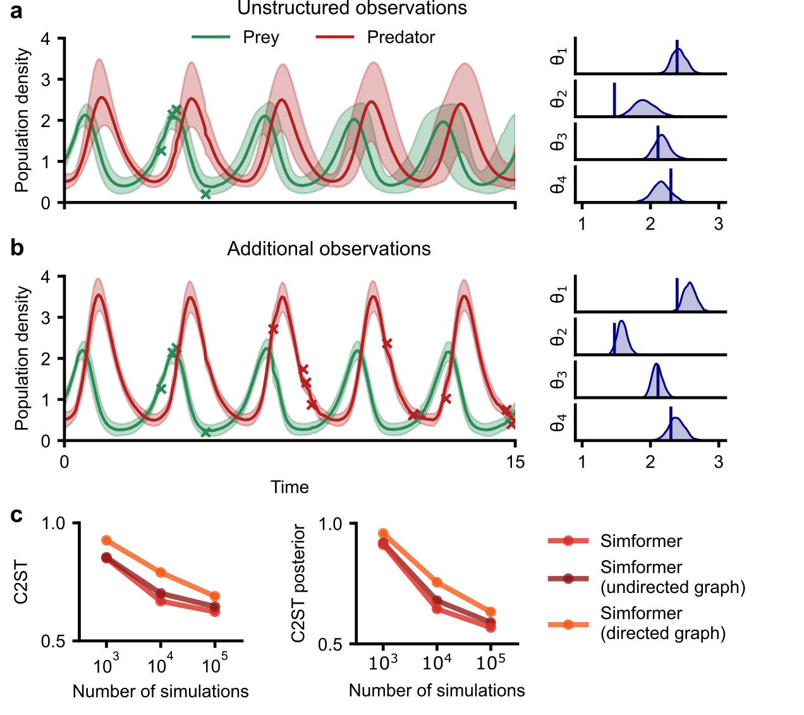

### Figure 5

This figure requires to run the following script:

```bash
scoresbi +experiment=bm_lv
scoresbi +experiment=bm_lv_eval1
scoresbi +experiment=bm_lv_eval2
scoresbi +experiment=bm_lv_eval3
``` 

Which should generate the following figure after running the notebooks

